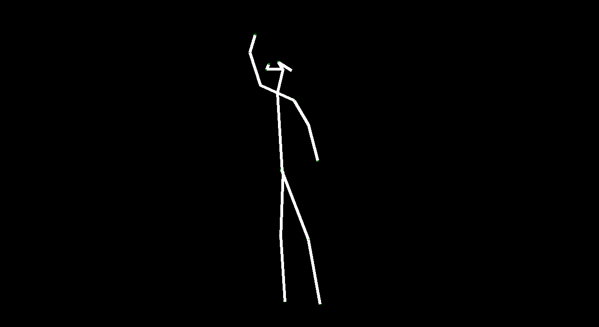
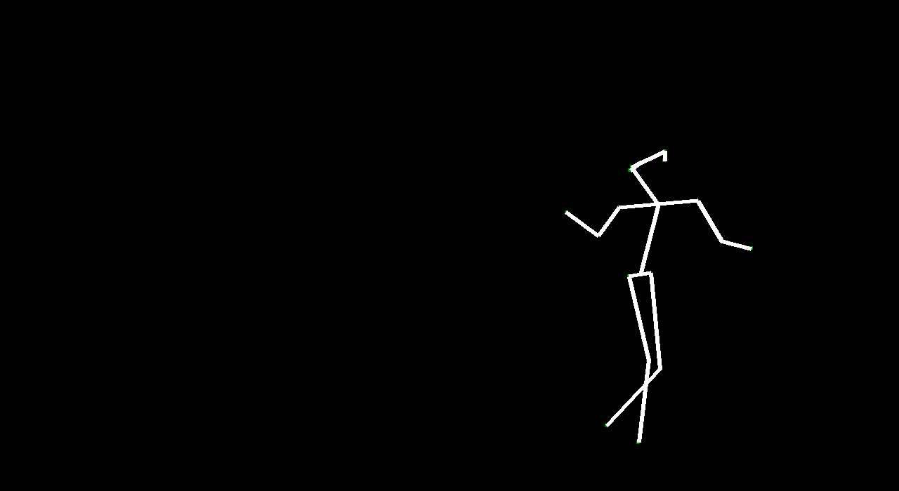
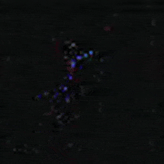
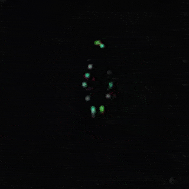
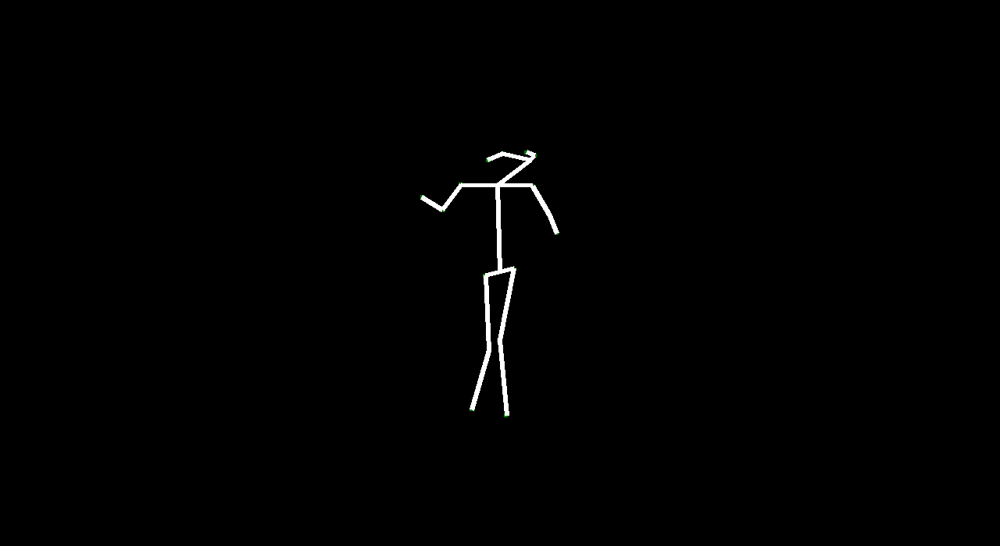
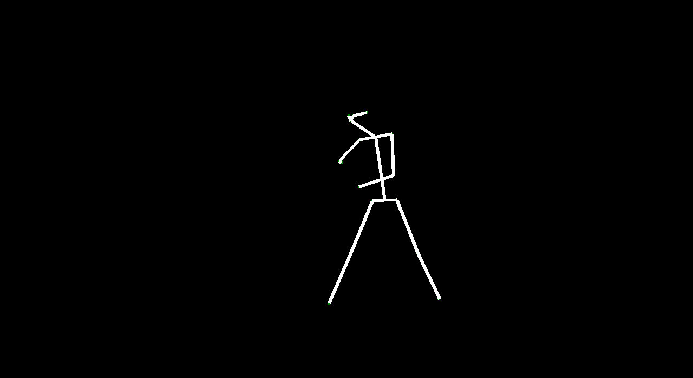
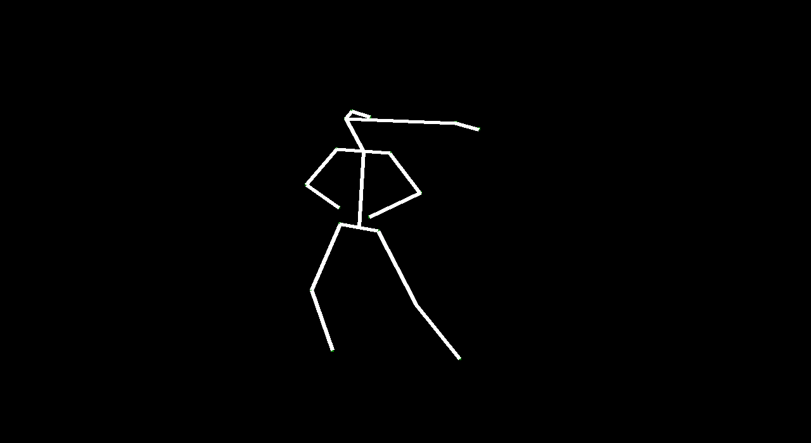

This is the final project my team and I worked on in graduate computer vision. I give a brief summary of what we did throughout the semester. Unfortunately, I can't release the code as per Cornell regulations, but feel free to read the final paper on the project (linked above). All the following pictures were generated by computers!

Our goal in this project is to see if it is possible to generate human poses using GANs. We draw inspiration from the paper, [Generating Videos with Scene Dynamics](http://www.cs.columbia.edu/~vondrick/tinyvideo/), which proposed a Generative Adversarial Network (GAN) for videos that untangle the scene's foreground from the background, also known as VideoGAN. VideoGAN generated videos that, while not photo-realistic, display motions that were fairly reasonable for the scenes it was trained on. Specifically, we explored generating poses by understanding human dancing, by training our models on the [Let’s Dance Dataset](https://www.cc.gatech.edu/cpl/projects/dance/). We evaluated how well VideoGAN is able to output dance video and we proposed a new architecture called VectorGAN that takes the vector representations of people dancing and generates videos.

Our intention in this project was to explore how computers can capture motion and generate it. By generating motion from a given frame, we can generate 'future' motion. There are lots of applications for generating “future” video such as video understanding and simulations and animation (specifically in Rigging avatars to automatically create ranges of motion). Given a starting image, we wanted to make predictions about certain events. We used dancing because human motion is fluid and defined in dancing, and the dataset we used was clearly categorized.

We implemented the following:

- VideoGAN Architecture - 32 Frames of Video
- Modified VideoGAN Architecture - 128 Frames of Video
- VectorGAN Architecture with Random Noise - 32 Frames of Video
- VectorGAN Architecture with Starting Vector - 32 Frames of Video
- VectorGAN Architecture Composited Video (using previous experiment) - 128 Frames of Video

VideoGAN: following the inspiration paper, [Generating Videos with Scene Dynamics](http://www.cs.columbia.edu/~vondrick/tinyvideo/), we implemented their model and generated 32 frames of video. We then modified their architecture and generated 128 frames of video. Overall, from the output video, this model does well in making a figure of a human doing a dance move. However, it is very noisy. We expected this from a model that takes in raw pixels. This also happened in the second experiment where, even though the generated dance video was longer, it was still blurry. However, VideoGAN recognized people and captured some of their movements (blue is 32 frames, green is 128 frames). 

VectorGAN: using the dance video's vector representation, we trained our model on the positions of human parts. Although VectorGAN had to be trained on more epochs to get something smooth, this method worked pretty well. The generated vector positions through time resemble a lot of the motion that ballet dancers do. It is interesting to note that the model figured out how the different limbs of humans connect to each other after about 100 epochs but needed much more to generate coherent movement. There are still a lot of places where the dancer’s limbs jerk, but we attribute this to the shortcomings of the dataset we used; not every single frame had a coherent human structure and some frames had nothing. We then tested the VectorGAN with an encoder added on to the beginning of the architecture that had the starting vectors of the input video. We then used this in the composited video experiment, where we generated 128 frame videos by feeding the last frame of a generated 32 frame video into the model 3 times (random noise, starting vector, and 128 frames in that order below).

Overall, VideoGAN and VectorGAN provide tangible results in generating videos of human pose. However, the frames generated VideoGAN were of very low resolution as computing images of stick figures is still very difficult. VectorGAN had much better results as we could animate together distinct key points to see the figure move more clearly. Our conclusion is that generating human pose is possible with VectorGAN, but we don’t have nearly enough training data. The original VideoGAN paper used over 35 million clips while we used only 84 videos for training our models. However, the results we got are promising. We only used the ballet dances from the dataset, but it would be interesting (and very time consuming) to see how the model does on other dances.