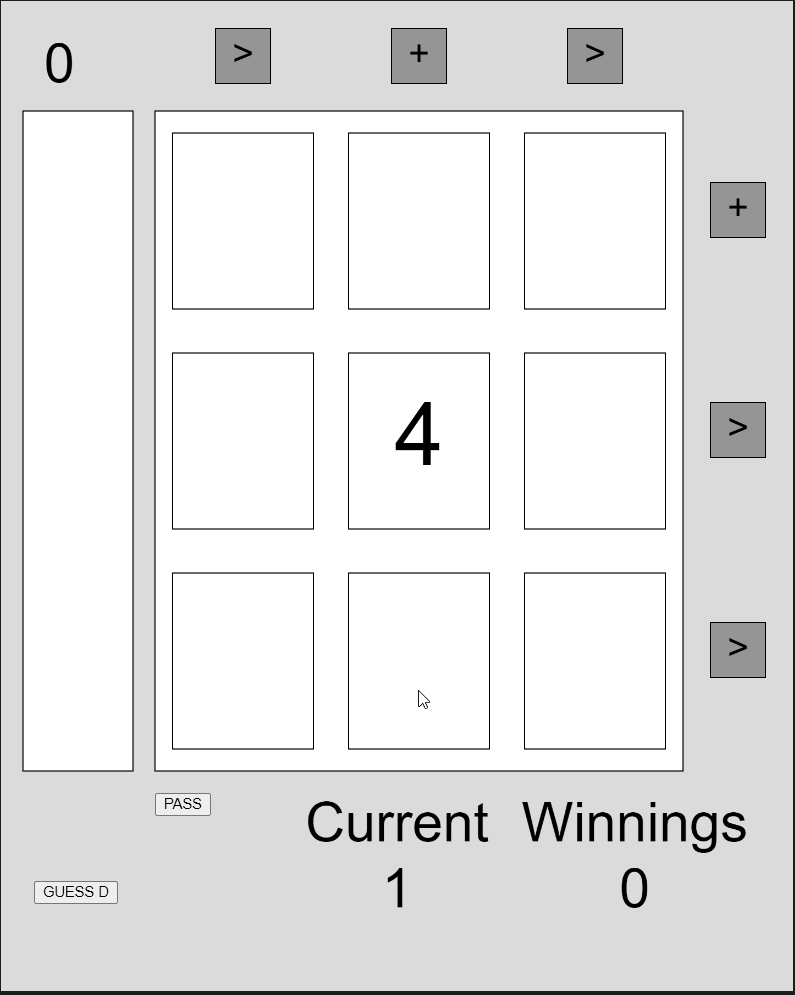

*Prototypes is a series on mini game prototypes I've made exploring a particular concept or idea. These games are prototypes - rough, unpolished, and only testing gameplay. By creating these prototypes I hope to gain a better understanding of vaious game design elements and how game designers create memorable, exciting, and fun games.*

A game of chance is a card game about calculated risk. I envision this game being played in a dark setting - you vs the world. I've always been fascinated by repeated games like poker, where your success is measured over numerous plays rather than just a singular encounter. One of my favorite strategy games, Teamfight Tactics, is also like this. I think games with variance have high replayability (see [Roguelikes](https://en.wikipedia.org/wiki/Roguelike)) and create really fun situations that challenge the player to (1) think about what they're dealt and, more importantly, (2) how to make the best use of the situation. While this game isn't that complicated, I wanted to recreate that feeling of high-stakes decision making.

[Play the game here!](https://editor.p5js.org/AmritAmar/sketches/NOS76yXVo) (hit the play button on the top left!)

How to Play:
- In front of you are 9 cards. There are 8 numbered cards (2-9) and 1 death card.

- Every time you opt to turn over a card, you wager 1 gold (this is what the "Current" means on the UI).

- If you hit a number card, continue! If you hit the death card, you will lose what you wagered + 2 gold.

- If you uncover everything, you win everything you wagered. If you pass the game, you will gain want you wagered - 2 gold.

- In addition, there are power ups to help you! If you get 3 in a row or column, you can use a power up to help you.

- (+) powerup allows you to select any card that hasn't been turned over and you will get a hint as to what the card could be above.

- (>) powerup allows you to select any uncovered card and reveals whether neighbor cards are higher or lower than the chosen card.

- In addition, you can guess where the death card is at any point by hitting the "GUESS D" button. If you successfully guess, you will gain, in addition to what you wagered, 3 times the number of remaining cards. If you fail, you will lose what you wagered + 10 gold.

After having playtests with some of my friends, I got a lot of feedback on the concept. They said that once they got the hang of the game, 'passing' after getting 4-5 cards correct will nearly always net you a win in the long run. They liked that the stakes only increased when you 'committed' more to the game and that losing by getting unlucky didn't feel bad. Some playtesters felt that 'passing' shouldn't even be a part of the game at all. When I tested the game by removing the 'passing', playtesters felt like they got really unlucky sometimes towards the end which killed their mood if it happened repeatedly. While they liked the powerups, almost all playtesters said that the (+) powerup felt too weak since you could technically get a (2+) on a 7 or 8 which didn't really help them. 

In the future, a more complete game would probably include a 'bank' of money that you wager (so that there's a concrete lose condition) along with more powerups and perhaps a bigger board (4x3 or 4x4). 