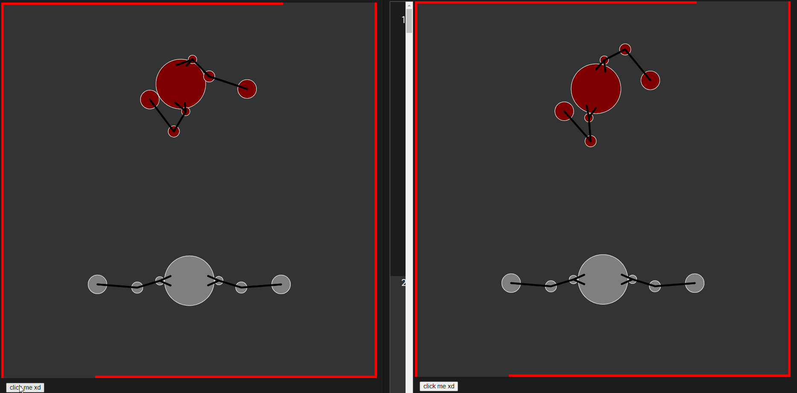
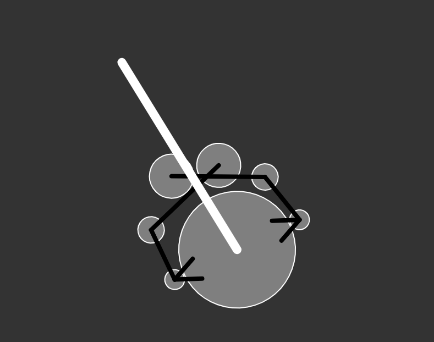

*Prototypes is a series on mini game prototypes I've made exploring a particular concept or idea. These games are prototypes - rough, unpolished, and only testing gameplay. By creating these prototypes I hope to gain a better understanding of vaious game design elements and how game designers create memorable, exciting, and fun games.*

Personally, I think pure turn-based games are a little bit draining to me. I love watching people play them and I love analyzing and understanding the meta behind them but playing them on my own feels a little lack-luster. I think it's because I prefer seeing things resolve simultaneously. I love seeing the action happen because of my decisions - the tense moment of making a choice and waiting for the effect to play out on my screen is exhilirating and fun! This is the main reason behind making "Punch!". I wanted to explore the feeling of making quick choices and hoping that you out-smarted your opponent. 

[Play the game here!](https://editor.p5js.org/AmritAmar/sketches/KMy4apE15) (hit the play button on the top left!)

Punch is a multiplayer game! Open the game with a friend (or across 2 browsers), ensure the **'CLIENT_CODE'** is the same, along with the **realtime** parameter set to what you'd like to try (true or false)! Then hit the 'click me' button below the main game window. The main game is played by getting your fist to touch the enemy's head. Do this by dragging on your body parts in a particular direction to add a 'force' to it. 

- realtime = true: The game is played in real-time with actions happening continuosly. Control the joints of your robot one-by-one and be the first to win!

- realtime = false: The game is played in 3 second intervals. You can control the joints of your robot and set each specific 'force' individually! After 3 seconds, the forces resolve and you get to make your next choices!

A little touch on the technical details: I used [matter.js](https://brm.io/matter-js/) as my physics engine and socket to communicate with a [glitch](https://glitch.com/) server! I send over the positions and velocity of the character based on requests from the server and synchronize them across connected clients. Yes, this means that this game is 'client-sided' and you *could* cheat by overriding those values. Creating a client-sided game would have been easier but that's a future project for another day.

From playtesting, one of the most interesting things to explore was ['who had the beatdown'](https://articles.starcitygames.com/articles/whos-the-beatdown/) (i.e. who had the advantage in a game). There is a steady flow to the game where players have to identify who is the one in the attacking (beat-down) spot and who is the one in the defending (control) spot. As these switched turn after turn, the concept of turns existing in real-time games makes sense - tempo is an important concept in several games. Performance and networking issues aside, playtesters thought it was a really fun game. A [meta](https://en.wikipedia.org/wiki/Metagaming#Computer_games) developed where players would basically protect themselves completely and then send their robot flying at the opponent with the hands in front.

