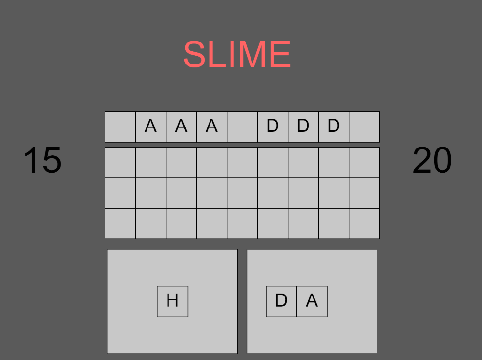

*Prototypes is a series on mini game prototypes I've made exploring a particular concept or idea. These games are prototypes - rough, unpolished, and only testing gameplay. By creating these prototypes I hope to gain a better understanding of vaious game design elements and how game designers create memorable, exciting, and fun games.*

Tile Punch is a fast-paced 'card' game about studying the opponent and laying out a board that resolves in real-time. You have think fast and provide an answer to your opponent's moves before they execute it. The catch is that you get to see their moves laid out at the beginning of a 'pattern'. At the end of it, the opponent will do something new and now you have to react to a new pattern! 

[Play the game here!](https://editor.p5js.org/AmritAmar/sketches/jJ4rbCXQy) (hit the play button on the top left - change the enemy type by going to line 93 and changing the assignment)

The game has 3 moves: A (attack 2), D (defend), H (heal 1). Every 'evaluation phase', an enemy move and a player move is calculated on the board. This evaluation travels right at a fixed interval, consuming player moves. The player can choose 2 randomly generated tiles to put on the board to combat the enemy, planning ahead for future mechanics.

In the fight below, I am fighting vs SLIME. Slime's move set is simple, it had 3 A's in a row, and 3 D's in a row. At the end of a pattern, it switches. This means I should have a tile to defend on the triple attacks and use the empty tile slots to attack. Defending against nothing doesn't hurt me so I can use that slot to heal. Alternatively we can attack each other when we both have A's in a column but because SLIME starts at 20 HP vs me at 15 HP, I need to close the gap first!

On a technical note: I tried to make the code as friendly to customize as possible. This means enemies have a function that the code calls to decide their next moves based on the previous enemy moves, the player moves, and the move history. This made it fairly easy to add new opponents as ideas came along and allow my friends to add their own enemies to fight against.

A lot of playtesters liked this one. The frantic decisions to make against a ticking clock is fun and challenging. One main problem playtesters brought up is that because the game moves fast and figuring out the move pattern of the enemy takes time, they often died the first time before they could succeed rather than figuring it out during the fight. One idea to fix this would be to list the previous enemy moves above the enemy to perhaps make pattern recognition easier. One thing the playtesters brought up is that the beginning of a pattern is always the hardest to react to since you don't get enough time to react to the first few columns.