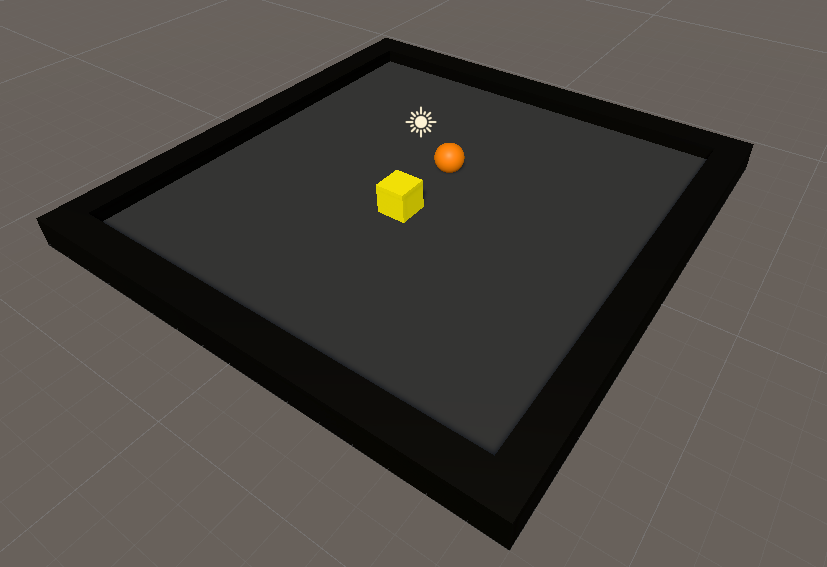
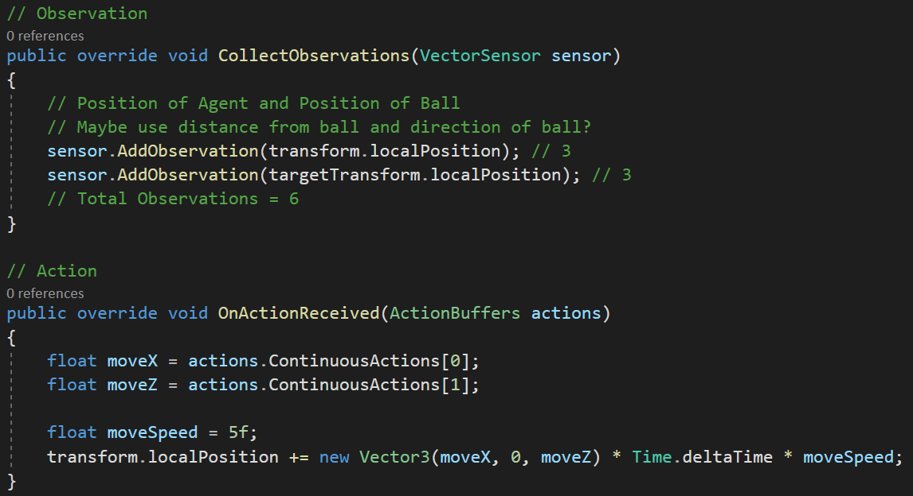
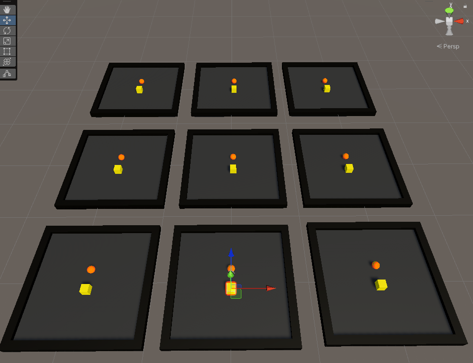
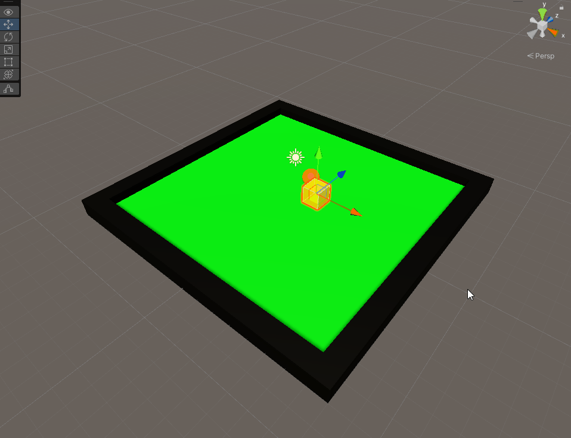
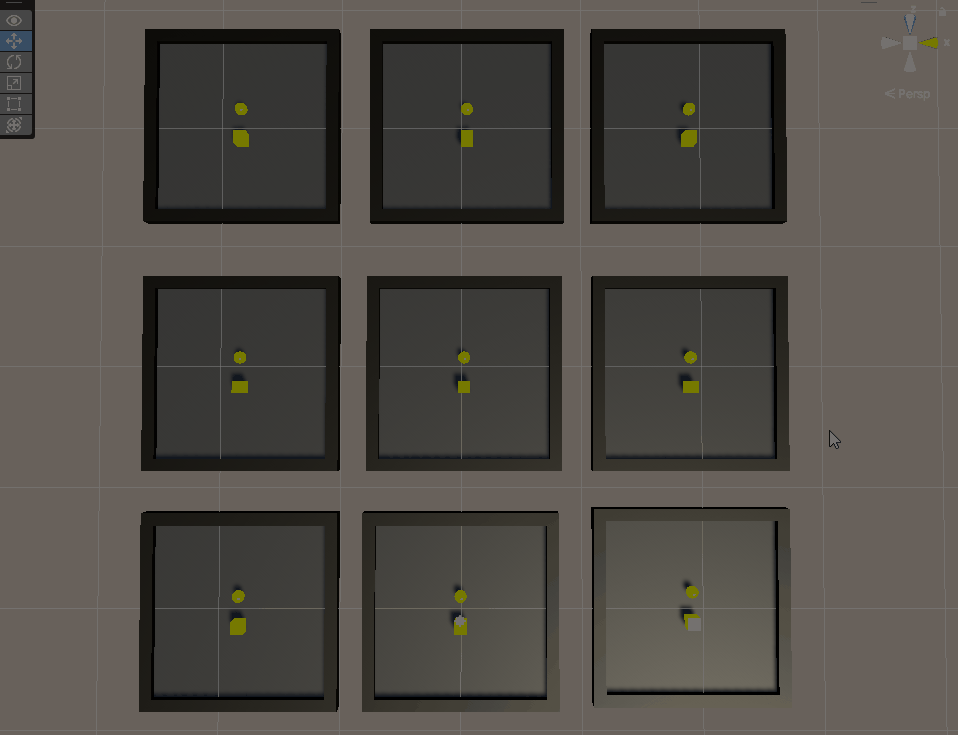

I only recently learned about [Unity's ML Agents Library](https://github.com/Unity-Technologies/ml-agents) - an open-source project to enable Unity projects to serve as environments for reinforcement learning algorithms. This is pretty cool because when I first started using Unity for AI, I had to implement the neural network itself and I used genetic algorithms to train my agents. With this project, training autonomous agents has never been easier with provided implementations of common RL algorithms along with a python interface to train! This project was done using [PPO](https://openai.com/blog/openai-baselines-ppo/).

The first step was setting up my environment. I created a new Unity project and then created a virtual environment to get all the python dependencies, which included pytorch and mlagents. Everything worked pretty smoothly - I was able to use my RTX 3080 for training. I then imported the Unity ML Agents module through Unity, it was super simple. After that, I created a basic environment modelled after Unity's own example: Move to Goal.

It's a simple setup - an environment with a simple cube agent and a sphere goal surrounded by walls. The agent's motive is simple: move to the goal without touching the wall. I created a script for the agent called "MoveToGoalAgent" and, to my surprise, it turns out that you don't need to inherit from MonoBehavior, but rather Agents. After reading through the docs, there were 4 key things I had to handle:

1. Observation (what does the agent see to make a decision)
2. Decision (the decision itself - handled by the library)
3. Action (how the decision translates to environment actions)
4. Reward (do we reward the agent for the actions it took)

While I thought about several ways to implement the observation, I decided to stick to providing the agent's location and the goal's location, which is a total of 6 inputs. The ml-agents library gives you the option of using continuous or discrete values for outputs. For this project, 2 continuous variables were enough to specify movement in the x or z directions. After testing passing and failing cases, I trained the environment in parallel with 9 separate instances.

It's pretty cool to see how they train over time. The red indicates that the agent failed (by hitting a wall) in the last iteration while green indicates the agent got to the goal. After about 2 minutes, I saw greens across the boards. However, ML isn't just about training specific tasks - it's about effectively training behaviours. My agent only knew how to get to the goal in one way. Move the goal elsewhere and it all went downhill. 

It's interesting to see how the position of the goal is actively affecting the neural network. To solve this, I randomized the starting and ending positions of the goal and the agent. I then re-trained the neural network and after a few minutes, loaded the trained neural network into Unity.

It worked really well! There were some boards that had issues during the validation but overall I think it was a success! I am looking forward to using this library for more complex RL tasks.

