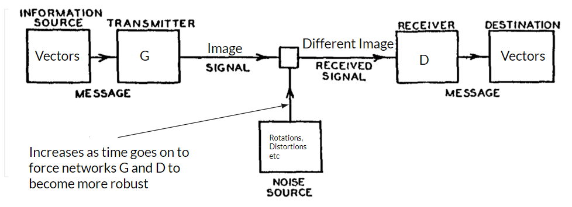

This is the final project my team and I worked on in advanced artificial intelligence. I give a brief summary of what we did throughout the semester. Unfortunately, I can't release the code as per Cornell regulations, but feel free to read the final paper on the project (linked above), along with the data. All the following pictures were generated by computers!

Communication isn’t perfect. Perhaps the room is too noisy or one party is distracted with another task but people often don’t understand each other perfectly; however, communication between people doesn’t break down. Similarly, in writing, we can still make out what the author intended to write on a piece of paper despite stains or wear down.  We explore the question, *can neural networks encode a language robust enough to be transmitted through noise channels and recreate the original meaning?*

Our goal in this project was to study the robustness of neural networks in encoding a language to communicate with one another. We used neural networks to generate images given vectors and transmitted those images over a noisy channel of communication. 
Another neural network received these images and decoded the image back to its vector representation. 
 

Our model is based on the Shannon-Weaver model of communication where the transmitter and receiver roles are played by two neural networks. G encodes a message. D decodes that message. As the networks get better at communicating, we increase the noise in the communication channel. 

We did the following experiments:
- Compare Grayscale and RGB output of networks
- Compare the impact of the size of output images between Grayscale models
- Compare the impact of the size of output images between RGB models
- The impact of noise on a larger dataset on grayscale networks.
- Qualitative Evaluation of RGB 64x64 Model with GloVe vectors

The first picture in this article belongs to a greyscale model outputting 36 8x8 images (A-Z, 0-9). The picture below is a color model outputting 36 8x8 images. 

Example 64x64 pictures. Greyscale:

Color:

We also did word embeddings using Twitter's GloVe embeddings:

An explanation of our experiments and more data can be found in the source can be found on our source page above. 

Overall, qualitatively, our models created images that look distinct from one another. For several of the one-hot models, we can clearly see differences between various encodings, similar to how we see differences between characters of various alphabets. The difference between real life communication and our model is that real life communication is based on alphabets that are defined by outlines and real images, while our models simply try to fill in a box with colors. It would be interesting to extend this project to generate scribbles rather than defined images. Interestingly, the lower the dimension of the generated image, the closer it resembles our own letters. Perhaps with smaller dimensions and more limitations, we could get something that resembles our own alphabet.